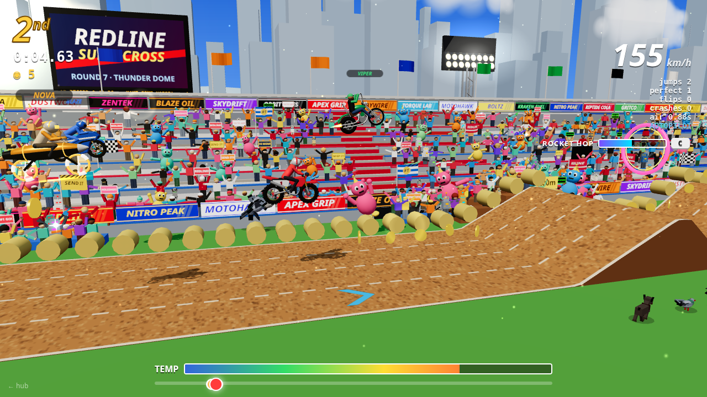
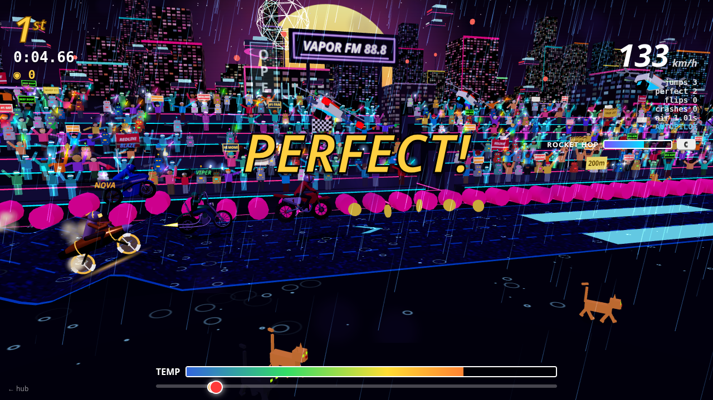
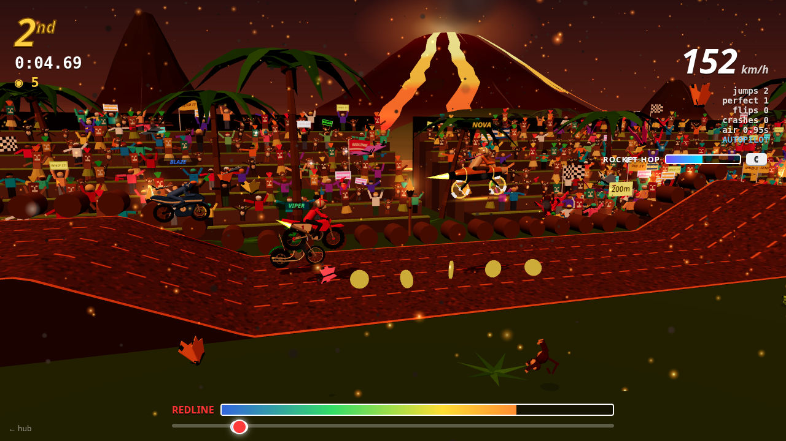
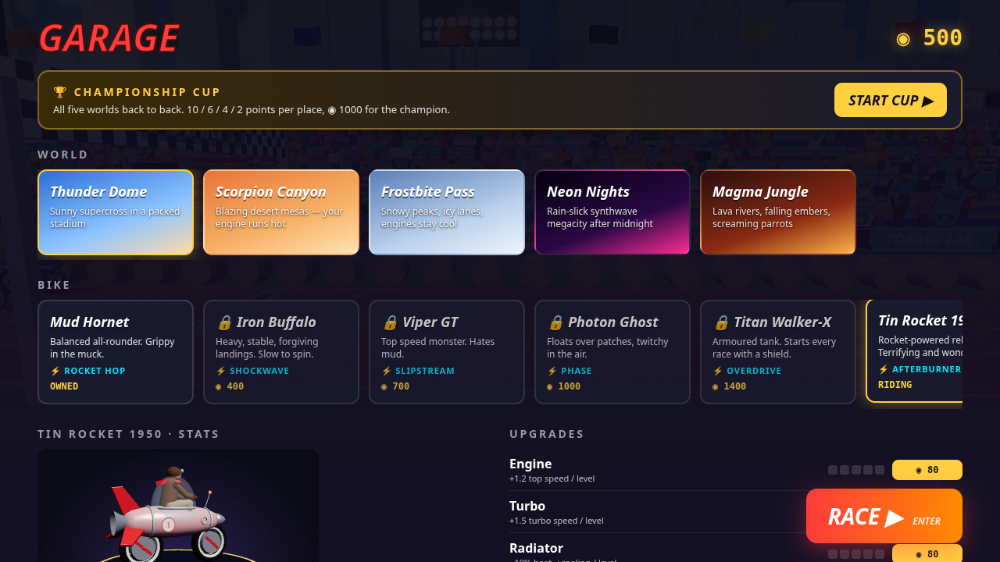

# CSCI 40 · Week 1 — AI App Lab

Prompt an AI to build a web game. Then watch it test its own work in a live browser.

This week two coding agents built games side by side in this one repo, sharing the same libraries and test harness:

| | |
|---|---|
| [](https://redlinemx.mattvalancy.com) | [](https://ashdrive.mattvalancy.com) |
| **[REDLINE MX](https://redlinemx.mattvalancy.com)** — built by **Claude** | **[ASHDRIVE](https://ashdrive.mattvalancy.com)** — built by **Codex** |
| Retro 3D motocross. Five worlds, a garage of six bikes with special abilities and upgrades, weather, wildlife, crowds of every kind, and a championship cup. · [code](apps/redline-mx) · [how to play](apps/redline-mx/README.md) | Open-world armored bike combat in an industrial district: drones, gunships, relays to raid, intel to extract. · [code](apps/ashdrive) · [how to play](apps/ashdrive/README.md) |

### More of REDLINE MX

| | | |
|---|---|---|
|  |  |  |
| Neon Nights: rain, oil slicks, lightning | Magma Jungle: lava crust, embers | Garage: bikes, abilities, upgrades |

## Run it yourself

```bash
npm run setup      # once: installs libraries + Playwright's Chromium
npm run dev        # hub at http://localhost:5173
npm run demo       # watch Claude race REDLINE MX in a real browser
npm run loop -- --owner=claude   # headed tests forever, left half of the screen
```

Ask Claude Code or Codex for anything, e.g. *"make a 3D asteroid shooter"* or *"build a synth drum machine"*. The agent scaffolds `apps/<name>/`, builds it, writes a Playwright test, and runs it headed. You can watch the browser drive itself.

The rules every agent follows (folder ownership, shared libraries, screen halves, the `ai` test fixture, deploys) are in **[AGENTS.md](AGENTS.md)**.

## License

[MIT](LICENSE)
