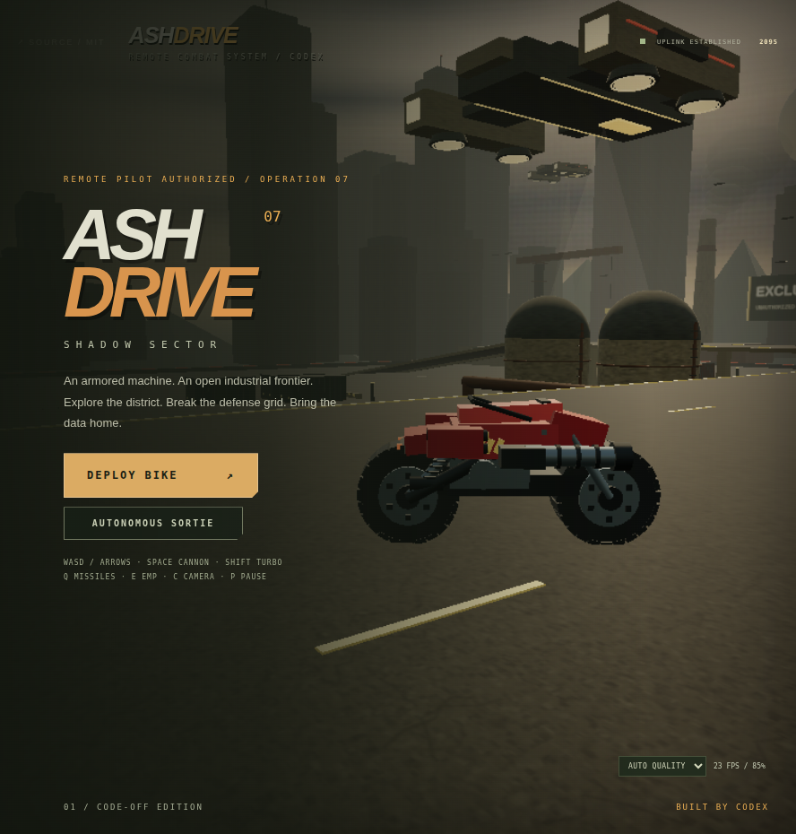

# ASHDRIVE — Shadow Sector



**[Play ASHDRIVE](https://ashdrive.pages.dev)** · [Public MIT source](https://github.com/mvalancy/ashdrive)

An open-world combat sandbox: pilot a remotely controlled armored motorcycle and freely explore a hostile industrial district. Start on the ground at the motorpool, choose your route through factory yards and elevated freeways, fight interceptor drones and gunships, and raid three defended relays. Recover their data and return to the motorpool extraction pad when ready.

An original open-source browser game built for the AI App Lab code-off, inspired by the military vehicle combat of 1995's Cyberbykes. Heavy red armor, exposed weapons, concrete freeways, smoke and olive transport craft establish the setting. All graphics and audio are generated by this project; no historical game assets are included.

## Play

| Control | Action |
| --- | --- |
| WASD / arrow keys | Throttle, reverse, steer |
| Space | Cannon |
| Shift | Turbo boost |
| Q | Guided missile |
| E | EMP |
| C | Cycle chase, cockpit, tactical camera |
| Tab / Map button | Tactical map; gameplay pauses while open |
| P | Pause / resume; Escape also resumes |
| M | Audio toggle |

Road lanes are optional routes through the district. Explore and approach objectives in any order, with no laps or race countdown. Destroy each relay with cannon fire or a missile, then drive within 10 meters of its dropped data case. Recover all three and return to the marked extraction pad where the mission started. Field supplies repair armor and replenish missiles. The **Autonomous Sortie** option demonstrates combat. The tactical map shows optional freeway routes, numbered relay status, enemies, your position and the motorpool extraction pad. Touch controls appear on supported small screens. While paused, Tab selects between Resume and Return to Hangar.

Rendering prefers **WebGPU**, with a **WebGL 2 fallback**. A modern browser with either backend is required; WebGPU normally requires HTTPS or localhost. Add `?renderer=webgl` to explicitly select the fallback. Audio starts after interaction. Once loaded, gameplay makes no external network requests; a first visit still needs the site's files.

## Graphics and performance

**Auto Quality** starts with a conservative rendering budget based on device capabilities. Performance and Balanced tiers remove bloom and shadows; High Detail and Ultra Detail enable those effects. Auto remembers the learned budget across retries and waits before increasing detail or retrying an expensive tier.

Emergency resolution scaling uses fresh GPU timings when supported: it avoids reducing clarity when low FPS comes from delays outside the game's GPU workload. If GPU timing is unavailable, it falls back to sustained frame rate. Under genuine rendering pressure it can step down to 35%, then restore resolution gradually when there is headroom. The HUD reports FPS and rendering scale.

Use the graphics selector to choose **Auto Quality**, **High Detail**, **Ultra Detail**, **Balanced**, or **Performance**. Manual choices remain fixed. Browser size, device pixel ratio and a pixel budget limit the actual resolution, so the displayed percentage can be lower than a tier's cap.

URL overrides are supported: `?quality=low`, `?quality=medium`, `?quality=high`, `?quality=ultra`, or `?quality=auto`. Combine options as `?renderer=webgl&quality=low`. Developers can add `?profile=1` for optional diagnostics; profiling is not required to play or use automatic quality. Performance still depends on the device and other active applications.

## Standalone development

Requires Node.js 22.12 or newer. In an exported or cloned standalone repository:

```sh
npm ci
npm run dev
```

Verify gameplay math and create the static production build:

```sh
npm run test:unit
npm run build
npm run preview
```

`dist/` contains the full static site. The unit tests exercise gameplay calculations; they do not replace interactive browser testing. GitHub Actions runs unit tests and the production build on pushes and pull requests.

## Shared AI App Lab development and release export

The lab uses one root dependency installation. Do not create package.json or node_modules inside this app folder. From the lab root:

```sh
npm run dev
npm run show ashdrive
node --test apps/ashdrive/tests/*.test.js
node apps/ashdrive/release.mjs /tmp/ashdrive-release
cd /tmp/ashdrive-release
npm install
npm run test:unit
npm run build
```

The exporter copies this game's source and pure unit tests, generates an MIT package with pinned installed dependency versions, and includes GitHub Actions and Cloudflare settings. Browser specs depend on the lab fixture and are excluded. The lab navigation link becomes a GitHub source link. An ownership manifest removes files from earlier exports when they disappear from the app, while retaining `.git`, installed dependencies, package-lock.json and unrelated local files. Re-export after game changes and run the release checks again. Commit package-lock.json with the exported source. The exporter itself remains in the lab.

To build this app directly using shared dependencies:

```sh
npx vite build --config apps/ashdrive/standalone.vite.config.js
```

## Public GitHub and Cloudflare Pages release

Public source: [mvalancy/ashdrive](https://github.com/mvalancy/ashdrive), licensed under MIT. Clone it to develop independently of the shared lab:

```sh
git clone https://github.com/mvalancy/ashdrive.git
cd ashdrive
npm ci
npm run dev
```

The game is live at **[ashdrive.pages.dev](https://ashdrive.pages.dev)**. The existing Cloudflare Pages project, `ashdrive`, uses **Direct Upload**. GitHub Actions tests and builds the source; pushing to GitHub does not automatically deploy this Pages project.

After validating a release locally, publish its static build with an authenticated Wrangler installation:

```sh
npm ci
npm run test:unit
npm run build
wrangler pages deploy dist --project-name ashdrive --branch main
```

Use Node.js 22, as declared in `.node-version`. `wrangler.toml` declares the `ashdrive` project and `dist` output directory. `public/_headers` supplies static asset caching and response headers. The game requires no application server or runtime account connection.

The custom hostname `ashdrive.mattvalancy.com` is associated with the Pages project and is awaiting its DNS record. In the Cloudflare DNS settings for `mattvalancy.com`, add:

| Type | Name | Target | Proxy |
| --- | --- | --- | --- |
| CNAME | `ashdrive` | `ashdrive.pages.dev` | Proxied |

The custom address becomes available after DNS verification and certificate activation. The `pages.dev` address remains playable while that completes.

Official documentation: [Wrangler Pages commands](https://developers.cloudflare.com/workers/wrangler/commands/pages/), [Pages custom domains](https://developers.cloudflare.com/pages/configuration/custom-domains/).

## License and reference

[MIT](LICENSE), copyright 2026 mvalancy, covers this project’s original source. Three.js is bundled under its own MIT license; its complete copyright and license notice is preserved in [public/THIRD_PARTY_LICENSES.txt](public/THIRD_PARTY_LICENSES.txt), also shipped at `/THIRD_PARTY_LICENSES.txt` in the built site. Development packages retain their respective licenses in their installed distributions. [REFERENCE.md](REFERENCE.md) records historical design research and links; it contains no original game assets.
